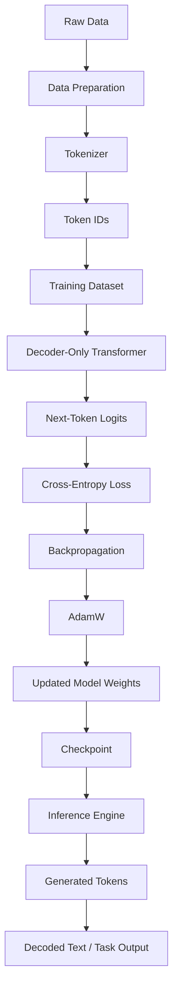
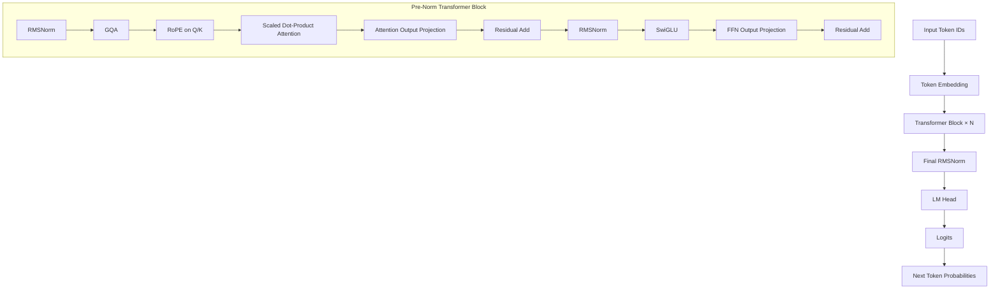
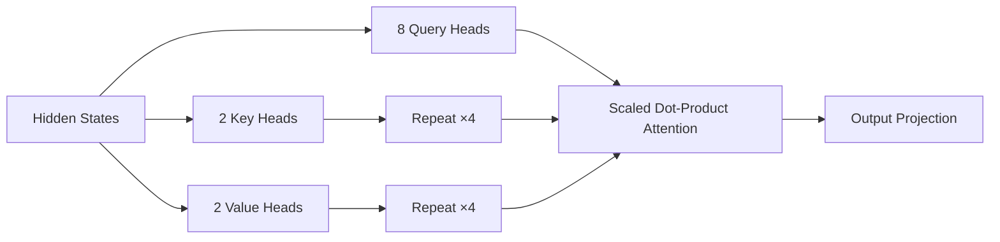
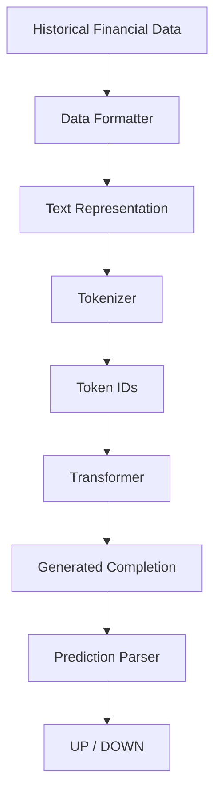

# Custom Decoder-Only Transformer Architecture

This document describes the architecture of **Axelion**, the custom decoder-only Transformer used in this project.

> [!IMPORTANT]
> The model is a modern decoder-only Transformer inspired by publicly described architectures such as LLaMA-family models. GPT-4's internal architecture is not publicly documented, so this project does not claim to reproduce GPT-4.

## 1. High-Level System Architecture



The Transformer itself is domain-agnostic. Financial prediction is one application of the model; the same core can later be trained on general text, code, mathematics, reasoning data, or multimodal representations.

## 2. Model Architecture



The architecture consists of:

- Token embeddings
- Pre-normalized Transformer blocks
- RMSNorm
- Grouped-Query Attention
- Rotary Positional Embeddings
- Scaled Dot-Product Attention
- SwiGLU feed-forward networks
- Residual connections
- Final RMSNorm
- Weight-tied language-model head
- Optional KV caching during autoregressive inference
- Optional gradient checkpointing during training

## 3. Token Embedding

Input token IDs:
```
[B, T]
```
are mapped to dense vectors:
```
[B, T, D]
```
where:
- `B` = batch size
- `T` = sequence length
- `D` = model dimension

The embedding matrix is:
```
[vocab_size, D]
```
The project uses a GPT-2-compatible vocabulary by default.

## 4. Transformer Block

Each Transformer block follows a pre-normalization structure:

```
x
│
├── RMSNorm
│
├── GQA Attention + RoPE
│
├── Output Projection
│
└── Residual Add
        │
        ├── RMSNorm
        │
        ├── SwiGLU
        │
        ├── Output Projection
        │
        └── Residual Add
```

Mathematically:
$$\text{h} = x + \text{Attention}(\text{RMSNorm}(x))$$
$$y = h + \text{SwiGLU}(\text{RMSNorm}(h))$$

This block is repeated $N$ times.

## 5. RMSNorm

RMSNorm normalizes activations using their root mean square without subtracting the mean.

For an input vector $x$:
$$\text{RMS}(x) = \sqrt{\text{mean}(x^2) + \varepsilon}$$
$$\text{RMSNorm}(x) = \frac{x}{\text{RMS}(x)} \odot \gamma$$

where:
- $\varepsilon$ prevents division by zero
- $\gamma$ is a learned scale parameter

Advantages include:
- Simple computation
- Stable optimization
- Lower overhead than mean-centered LayerNorm
- Common usage in modern decoder-only LLMs

## 6. Grouped-Query Attention

The attention implementation supports separate numbers of query heads and key/value heads.

Example:
- Query heads: 8
- KV heads: 2

The query heads are grouped so multiple query heads share the same key/value heads.



This reduces the size of the KV cache compared with standard multi-head attention.

The implementation requires:
`n_heads % n_kv_heads == 0`

For example:
$8 / 2 = 4$, so every KV head is shared by four query heads.

## 7. Rotary Positional Embeddings

The model does not use learned absolute positional embeddings. Instead, RoPE rotates query and key vectors according to their token positions.

For paired dimensions:
$$q'_1 = q_1 \cos(\theta) - q_2 \sin(\theta)$$
$$q'_2 = q_1 \sin(\theta) + q_2 \cos(\theta)$$

The same operation is applied to keys. This allows positional relationships to be incorporated directly into attention.

> [!WARNING]
> **Important limitation:** RoPE itself does not guarantee arbitrary context-length extrapolation. If the model is trained at a context length of 2,048 tokens, using it at 32,768 tokens without appropriate context-extension training or evaluation is not automatically reliable.

## 8. Scaled Dot-Product Attention

After RoPE:
$$\text{Attention}(Q,K,V) = \text{softmax}\left(\frac{QK^T}{\sqrt{d_{\text{head}}}}\right)V$$

The implementation uses PyTorch's `torch.nn.functional.scaled_dot_product_attention`. This allows PyTorch to select an optimized attention backend when the hardware and tensor configuration support it.

The implementation therefore avoids manually implementing a separate "Flash Attention" kernel.

## 9. SwiGLU Feed-Forward Network

The feed-forward network uses a gated SwiGLU structure.

Conceptually:
$$\text{gate} = \text{SiLU}(W_1 x)$$
$$\text{value} = W_3 x$$
$$\text{output} = W_2(\text{gate} \odot \text{value})$$

This is:
$$\text{SwiGLU}(x) = W_2(\text{SiLU}(W_1 x) \odot W_3 x)$$

where $\odot$ denotes element-wise multiplication.

Compared with a simple `Linear → GELU → Linear` MLP, SwiGLU provides an additional learned gating path.

## 10. Residual Connections

Residual connections preserve information across Transformer blocks.

Attention:
$$h = x + \text{Attention}(\text{RMSNorm}(x))$$

Feed-forward:
$$y = h + \text{FFN}(\text{RMSNorm}(h))$$

These connections are essential for stable optimization of deep Transformer networks.

## 11. Final Language Modeling Head

After the final Transformer block:
```
hidden states
      ↓
Final RMSNorm
      ↓
LM Head
      ↓
Vocabulary logits
```

For a vocabulary size $V$, the output has shape:
`[B, T, V]`

Each position predicts the probability distribution for the next token.

## 12. Weight Tying

The language-model head shares its weight matrix with the token embedding layer:
`self.lm_head.weight = self.tok_emb.weight`

Therefore:
Embedding weights == LM Head weights

This reduces the number of independent parameters and is a common language-modeling technique.

## 13. KV Cache

During autoregressive generation, previous key/value tensors can be cached.

Without caching:
- Generate token 1 → recompute previous tokens
- Generate token 2 → recompute previous tokens
- Generate token 3 → recompute previous tokens

With KV caching:
```
Previous K/V → Cache
                  ↓
New token → New K/V → Append
                  ↓
              Attention
```

This significantly reduces unnecessary computation during token-by-token generation. The cache is maintained separately for every Transformer block.

## 14. Training Architecture


Training uses next-token prediction. For a sequence `A B C D E`, the model learns:
- A → B
- B → C
- C → D
- D → E

The standard causal language-model objective is:
$$\mathcal{L} = -\sum \log P(x_t \mid x_{<t})$$

## 15. Gradient Checkpointing

Gradient checkpointing can be enabled for training. Instead of storing every intermediate activation:

```
Forward
   ↓
Store selected activations
   ↓
Backward
   ↓
Recompute missing activations
```

This reduces memory usage at the cost of additional computation. It is especially useful when training larger models on limited GPU memory.

## 16. Mixed Precision

The training system can use reduced-precision computation such as FP16 or BF16 when supported by the hardware and training configuration.

The exact precision should be selected according to the GPU and numerical stability requirements.

## 17. Model Configuration

A typical configuration is:

```python
ModelConfig(
    vocab_size=50257,
    dim=512,
    n_layers=8,
    n_heads=8,
    n_kv_heads=2,
    hidden_mult=3.5,
    max_seq_len=2048,
    dropout=0.0,
    rope_theta=10000.0,
)
```

Example dimensions:
- Embedding dimension: 512
- Transformer layers: 8
- Query heads: 8
- KV heads: 2
- Head dimension: 64
- Context length: 2048
- Vocabulary: 50257

Since $512 / 8 = 64$, the attention head dimension is 64.

## 18. Parameter Flow

```
Token IDs
   ↓
Embedding
   ↓
┌──────────────────────────────┐
│ Transformer Block            │
│                              │
│ RMSNorm                      │
│    ↓                         │
│ GQA                          │
│    ↓                         │
│ RoPE                         │
│    ↓                         │
│ SDPA                         │
│    ↓                         │
│ Residual                     │
│    ↓                         │
│ RMSNorm                      │
│    ↓                         │
│ SwiGLU                       │
│    ↓                         │
│ Residual                     │
└──────────────────────────────┘
             × N
   ↓
Final RMSNorm
   ↓
Tied LM Head
   ↓
Logits
```

## 19. Financial Prediction Application

The Transformer can be used as a language-modeling component inside a financial-data experiment.



This should be interpreted as an experimental language-model-based forecasting system.

> [!CAUTION]
> It should not be described as a guaranteed financial forecasting engine. Market prediction requires proper time-based validation, leakage prevention, baselines, transaction-cost modeling, and out-of-sample evaluation.

## 20. General-Purpose LLM Extension

The Transformer core is intentionally independent of finance. A future general-purpose model can use the same architecture:

```
                    MODEL CORE
                        │
        ┌───────────────┼────────────────┐
        │               │                │
      Text             Code           Mathematics
        │               │                │
        └───────────────┼────────────────┘
                        │
                   Pretraining
                        │
                   Instruction
                     Tuning
                        │
              Preference / Alignment
                        │
              Tool / Function Calling
                        │
                  Model Family
```

Finance becomes one domain rather than the definition of the underlying model.

## 21. Recommended Model Family

The architecture can later scale by changing:
- Number of layers
- Embedding dimension
- Attention heads
- KV heads
- Vocabulary size
- Context length
- FFN dimension

For example:

| Model | Layers | Dim | Q Heads | KV Heads |
|-------|--------|-----|---------|----------|
| Micro | 4 | 128 | 4 | 2 |
| Small | 8 | 512 | 8 | 2 |
| Medium | 24 | 1024 | 16 | 4 |
| Large | 32 | 2048 | 32 | 8 |
| XL | 48 | 4096 | 32 | 8 |

These are architectural examples, not claims about capability. Increasing parameter count alone does not produce GPT/Claude-class intelligence. Dataset quality, data quantity, training compute, optimization, tokenizer quality, post-training, evaluation, and inference infrastructure all matter.

## 22. Implementation Requirements

The architecture implementation should maintain these invariants:
- `dim % n_heads == 0`
- `n_heads % n_kv_heads == 0`
- `head_dim` is even for RoPE pairing
- `sequence_length <= max_seq_len`
- `token IDs < vocab_size`

For example:
- `dim = 512`
- `n_heads = 8`
- `n_kv_heads = 2`

$512 \% 8 == 0$, $8 \% 2 == 0$, and $64 \% 2 == 0$. All conditions are satisfied.

## 23. Project Architecture

```
LLM/
├── model.py              # Transformer architecture
├── config.py             # Training/model configuration
├── tokenizer.py          # Tokenization
├── dataset.py            # Dataset loading
├── train.py              # Training loop
├── generate.py           # Text generation
├── finance_data.py       # Financial data preparation
├── stock_predictor.py    # Financial prediction application
│
├── train_data.txt        # Source training data
├── train_data.bin        # Tokenized training data
├── ckpt.pt               # Model checkpoint
│
└── docs/
    └── README.md
```

## 24. Architecture Summary

The model is a decoder-only autoregressive Transformer with:

- [x] RMSNorm
- [x] RoPE
- [x] Grouped-Query Attention
- [x] Scaled Dot-Product Attention
- [x] SwiGLU
- [x] Pre-Norm residual architecture
- [x] Weight tying
- [x] KV caching
- [x] Gradient checkpointing
- [x] Mixed-precision-compatible training
- [x] Causal next-token prediction

The core architecture is suitable as a foundation for experimentation with progressively larger language models.

The most important future improvements are not simply adding more architectural tricks. The highest-impact areas will be:
- High-quality training data
- Large-scale pretraining
- Correct tokenizer/data pipeline
- Stable optimization
- Scaling experiments
- Instruction tuning
- Preference/alignment training
- Tool use
- Long-context training
- Rigorous evaluation